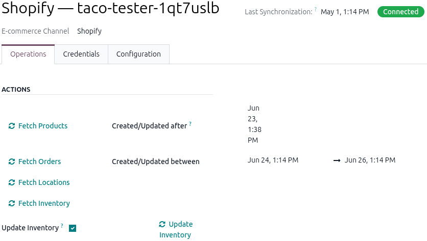

=====================================
Shopify connector set up instructions
=====================================

This integration only works with `Odoo SH <http://odoo.sh/>`_ and requires version 19.0. The
following are items are needed to connect a Shopify store to Odoo:

- A Shopify account
- Odoo database
- The `Shopify connector <https://www.odoo.com/odoo/knowledge/29957#0b4e031a393ba72c>`_

It’s best to keep the Odoo database and Shopify account dashboard in the same browser for the
setup. Don’t worry, this is a one-time process.

Go into developer mode
======================

#. From the Odoo landing page, open the **Settings** app. The app opens on the *General Settings*
   tab by default.
#. Scroll down to the *Developer Tools* section, click **Activate the developer mode (with
   assets)**.

   .. image:: set-up-instructions/activate-developer-mode.png
      :alt: Example of the Developer Tools section on the General settings tab.

.. _shopify/set-up-instructions/create-shopify-account:

Create a Shopify account in Odoo
================================

#. Open the **Sales** app and go to the **Configuration** menu.
#. Under the *Shopify* section, click **Accounts**.
#. Click **New** to create a new account for the Shopify store. If one already exists in Odoo skip
   to **step 7**.
#. On the blank *Shopify Account* form page, start by choosing a name for the account (e.g. American
   Marketplace).
#. Select **Shopify** for the **E-commerce Channel**.
#. Choose the preferred option for the **Delivery Handled On** field.
#. Select **Oauth** for the **Authorization Type**.

   - Note: The *Oauth* option is mandatory for stores created on or after January 1, 2026. Stores
     created before that date can use the *Self Access* option.
#. Click **Copy App URL**.

   - Example of copied URL:
     `https://example.com/odoo/ecommerce.account/ecommerce.account/1/shopify/app`

   .. image:: set-up-instructions/shopify-account-form.png
      :alt: Example of a Shopify account form in Odoo.

Now in a new browser tab, let's go to our Shopify account to create a store we’ll link to Odoo.

Create an app in Shopify
========================

9. Sign in to `the admin account or create a new one <https://admin.shopify.com>`_.
#. Either navigate to the existing app to link to Odoo or create a new one.
#. Open the *Settings* menu and select **App Development**.

   - **Pro tip**: Use the search bar to enter `App development` to find the feature.

   .. image:: set-up-instructions/shopify-app-development.png
      :alt: Example of using the search bar to find the App development option.

#. Click **Build apps in Dev Dashboard** to access the dev dashboard.

   .. image:: set-up-instructions/shopify-build-apps-dev-dashboard.png
      :alt: The Build app in Dashboard button.

#. Click **Create app** to begin creating a new app.
#. In the *Start from Dev Dashboard* option, enter the app name and click **Create**.
#. In the *Create Version* page, enter the following information for the listed fields:

   - **App URL**: Paste the copied URL from **step 4** of the :ref:
     `shopify/set-up-instructions/create-shopify-account`section.
   - Disable the **Embed app in Shopify admin** checkbox.
   - **Webhooks API version**: 2026-01.
     - Note: Check the :doc:`index` page for the latest version of the *Webhooks API*.
   - In the *Access* section, ensure the *Scopes* tab is selected. Then copy the following
     code block and paste it into the tab:
     ``read_assigned_fulfillment_orders,write_assigned_fulfillment_orders,read_customers,write_inventory,read_inventory,read_locations,read_merchant_managed_fulfillment_orders,write_merchant_managed_fulfillment_orders,read_orders,read_products,read_third_party_fulfillment_orders,write_third_party_fulfillment_orders,read_fulfillments,write_fulfillments,read_returns``

     .. image:: set-up-instructions/shopify-app-config.png
        :alt: Example of the Shopify app configuration settings.

#. Click the **Release** button at the top of the page, then click **Release** again to release the
   app with the version name.

Connect Shopify app to the Odoo Shopify account
===============================================

17. Click **Settings** in the navigation bar to go to the *Settings* page.
#. Copy the **Client ID** and **Client Secret** from the *Credentials* section.

   .. image:: set-up-instructions/shopify-credentials.png
      :alt: Example of the Client ID and Client Secret from Shopify.

#. Paste these into the **Shopify Client Id** and **Shopify Client Secret** fields in the
   *Credentials* tab in the Odoo browser.

   .. image:: set-up-instructions/odoo-credentials.png
      :alt: Example of the Client ID and Client Secret configured in the Credentials tab.

Install app in the Shopify store
================================

20. Go back to the *Shopify* tab in the web browser and click the app's name.
#. Click **Install app**, then on the new page select the Shopify store to link to Odoo, and click
   **Install**. After installing the app in the Shopify store, the page redirects to the Shopify
   account in Odoo.

   .. image:: set-up-instructions/shopify-install-app.png
      :alt: Install app on the Dev dashboard.

#. Verify that the app is connected by checking the account connection status in the top-right
   corner.
#. Confirm that the access token has been fetched in the **Shopify Access Token** field.

   .. image:: set-up-instructions/shopify-access-token.png
      :alt: Example of Shopify account form with the Access Token.

Congrats! You have successfully integrated the Shopify connector with your Odoo Sales app. Now that
it’s connected, you can perform sales operations between Odoo and Shopify based on the option
selected in the *Delivery Handled On* field of the SHopify account form.

.. toctree::
   :titlesonly:
  - index
  - reconnect-instructions

